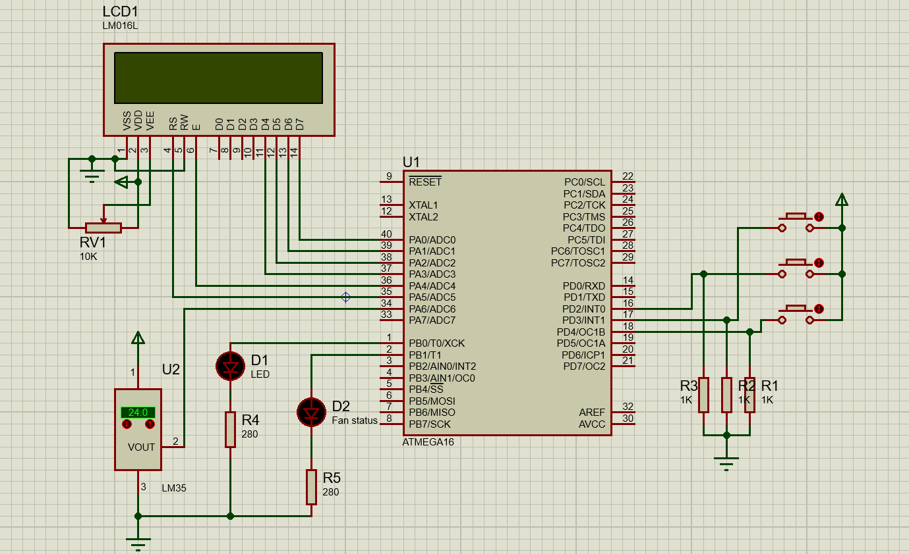

# AVR Menu System Using FSM (BASCOM AVR)

[English](#english-documentation) | [فارسی](#مستندات-فارسی)

---

## 🧭 [English Documentation](#english-documentation)

This project implements a simple, efficient menu system for the **ATmega16** microcontroller using the concept of a [Finite-State Machine (FSM)](https://en.wikipedia.org/wiki/Finite-state_machine). The menu is displayed on a **16x2 character LCD** and controlled with three buttons (UP, DOWN, SELECT). The **SELECT button uses INT0 external interrupt** to enter/confirm menu actions.

### 🚀 Features

- ⚙️ Structured menu navigation with a state machine
- 📟 LCD 16x2 menu interface
- 🎛️ 3-button control (UP, DOWN, SELECT)
- ⏱️ External interrupt (INT0) for clean SELECT behavior
- 💾 Edit and save settings interactively
- 🧪 Example options: LED control, temperature threshold

### 🛠️ Hardware Requirements

| Component      | Pin        |
|----------------|------------|
| LCD 16x2       | PA(0-5)      |
| LM35           | PA6         |
| Button UP      | PD3        |
| Button DOWN    | PD4        |
| Button SELECT  | PD2 (INT0) |
| LED (optional) | PB0         |
| Fan (optional) | PB1         |

### 📂 Folder Structure

```
AVR-Menu-BASCOM/
├── Bascom Code/
│   └── menu_state_machine.bas
├── Simulation (Proteus)/
│   └── AVR_Menu_Simulation.pdsprj
├── docs/
│   └── screenshot.png
├── LICENSE
└── README.md
```

### 🧪 Usage Instructions

1. Open `.bas` file with **BASCOM AVR** IDE.
2. Compile and upload to an **ATmega16** MCU.
3. Connect LCD and buttons as per pin mapping.
4. Press **SELECT (INT0)** to enter menu.
5. Use **UP/DOWN** to navigate.
6. Press **SELECT** again to confirm or enter edit mode.
7. Press **SELECT** again to save and exit.

### 📸 Preview



---

## 🏷️ Tags

`avr` `bascom` `lcd-menu` `finite-state-machine` `microcontroller` `embedded` `fsm` `interrupt-driven-menu`

---

## 📜 License

This project is licensed under the [MIT License](LICENSE).

---

## 📘 [مستندات فارسی](#مستندات-فارسی)

این پروژه یک سیستم منوی ساده و ساختارمند را برای میکروکنترلر **ATmega16** پیاده‌سازی می‌کند که مبتنی بر مفهوم [ماشین حالت محدود (FSM)](https://fa.wikipedia.org/wiki/ماشین_حالت) می‌باشد. این منو روی نمایشگر LCD 16x2 نمایش داده شده و با سه دکمه (بالا، پایین، انتخاب) کنترل می‌شود. دکمه انتخاب با استفاده از **وقفه خارجی INT0** عمل می‌کند.

### 🚀 ویژگی‌ها

- ⚙️ پیمایش منو با استفاده از معماری ماشین حالت
- 📟 رابط منو روی LCD کاراکتری 16x2
- 🎛️ کنترل با سه دکمه (بالا، پایین، تایید)
- ⏱️ استفاده از وقفه خارجی برای دکمه تایید (INT0)
- 💾 امکان ویرایش تنظیمات و ذخیره آن‌ها
- 🧪 گزینه‌های نمونه: کنترل LED، تنظیم دمای مرجع

### 🛠️ نیازمندی‌های سخت‌افزاری

| قطعه             | پایه متصل   |
|------------------|-------------|
| LCD 16x2         | PA(0-5)       |
| LM35             | PA6         |
| دکمه بالا        | PD3         |
| دکمه پایین       | PD4         |
| دکمه تایید (انتخاب) | PD2 (INT0) |
| LED (اختیاری)    | PB0         |
| Fan (اختیاری)    | PB1         |

### 📁 ساختار پوشه‌ها

```
AVR-Menu-BASCOM/
├── Bascom Code/
│   └── menu_state_machine.bas
├── Simulation (Proteus)/
│   └── AVR_Menu_Simulation.pdsprj
├── docs/
│   └── screenshot.png
├── LICENSE
└── README.md
```


### 🧪 طریقه استفاده

1. فایل `.bas` را با نرم‌افزار BASCOM AVR باز کنید.
2. کامپایل کرده و روی میکروکنترلر ATmega16 فلش کنید.
3. LCD و دکمه‌ها را طبق جدول بالا متصل کنید.
4. دکمه **تایید (INT0)** را برای ورود به منو بزنید.
5. با دکمه‌های **بالا/پایین** بین گزینه‌ها حرکت کنید.
6. دوباره دکمه تایید را برای ورود به ویرایش بزنید.
7. بار دیگر دکمه تایید را برای ذخیره تنظیمات و خروج بزنید.

### 📸 پیش‌نمایش


---

## 🏷️ برچسب‌ها (تگ‌ها)

`AVR` `BASCOM` `ماشین حالت` `FSM` `سیستم منو` `میکروکنترلر` `LCD منو` `وقتی اینتراپت` `پروژه AVR`

---

## 📜 مجوز

این پروژه تحت مجوز [MIT](LICENSE) منتشر شده است و استفاده از آن آزاد است.
